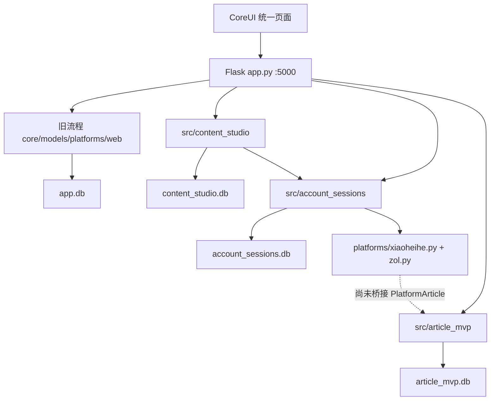

# ArticleOps / 自动化文章发布与数据采集项目交接

> 生成日期：2026-08-13（Asia/Shanghai）
> 交接类型：CSA 上下文压缩 + 当前仓库只读复核
> 适用代码：`refactor/publisher-collector-architecture@f12d1b070c7e3b8aa22503f6501007c10856175f`
> 重要原则：本文只把已经存在于当前集成分支的代码称为“已实现”；计划、历史测试和真实平台闭环严格分开。

## 0. 先看这里：当前真实结论

当前项目已经完成统一 Flask 服务、CoreUI 工作台、多账号会话、独立内容域、
小黑盒发布映射/采集 MVP 数据模型和数据中心的代码集成，但**还不能称为生产稳定闭环**。

当前必须优先处理的两个断点：

1. **P0：小黑盒和 ZOL 的多行正文回读校验回归尚未修复。**
   新工作台把整篇多段正文作为一个 text block 传给两个旧平台适配器；适配器写入富文本
   编辑器后仍用整块原始换行字符串做精确子串校验。编辑器会规范换行和 DOM 文本，导致
   已经写入的正文被误判为缺失。2026-08-13 已产生 1 个小黑盒草稿失败执行单和
   2 个 ZOL 草稿失败执行单。修复前不要继续真实平台重试，更不要开启公开发布。
2. **统一工作台与数据采集映射尚未桥接。**
   `src/content_studio` / `src/account_sessions` 的投递成功结果目前不会调用
   `PublishedEventService`，不会自动写入 `article_mvp.PlatformArticle`。因此“统一工作台投递
   → 数据中心文章映射 → HTTPX 指标采集”尚未贯通。

此外，小黑盒采集 Endpoint 仍为 `legacy_unverified`，采集器会正确拒绝运行；必须先做真实
Network 探测并固化 `verified` 契约，不能填写猜测 URL 或伪造指标。

---

## 1. 真正的本地代码位置

### 1.1 唯一应作为交付基线的仓库

```text
D:\Backup\Documents\article-auto-publisher
```

本次 Codex 会话的当前目录是：

```text
D:\自动化文章发布--数据采集
```

它**不是**真正的 Git 仓库。后续接手者不要在该目录误找代码、误启动服务或误提交。

### 1.2 Git 事实

- SSH 远端：`git@github.com:Ulysses-G-Yang/article-auto-publisher.git`
- 当前集成分支：`refactor/publisher-collector-architecture`
- 当前本地/远端 HEAD：`f12d1b070c7e3b8aa22503f6501007c10856175f`
- 本地与远端分歧：`0/0`
- 当前唯一既存脏项：`D:\Backup\Documents\article-auto-publisher\工作汇报_731.md` 被用户删除。
- **绝不能恢复、暂存或把 `工作汇报_731.md` 纳入任何提交。**
- 本地 `main` 不是当前交付基线；不要从它继续本轮工作。

### 1.3 关键集成提交序列

```text
d0dceec  merge: guard legacy session cleanup
3a99300  merge: add unified content studio backend
55698e5  merge: add official CoreUI content studio frontend
764657f  merge: restore reproducible CoreUI build
52945e9  merge: add responsive studio QA evidence
b11e897  merge: harden mobile content studio QA
f12d1b0  merge: pin CoreUI runtime exactly
```

### 1.4 重要功能分支和 worktree

| 用途 | 分支 / HEAD | 本地绝对路径 |
|---|---|---|
| 当前集成 | `refactor/publisher-collector-architecture@f12d1b0` | `D:\Backup\Documents\article-auto-publisher` |
| Content Studio 后端 | `refactor/content-studio-backend@99ef34f` | `D:\Backup\Documents\article-auto-publisher-worktrees\content-studio-backend` |
| CoreUI 前端 | `refactor/coreui-studio-frontend@4b7169b` | `D:\Backup\Documents\article-auto-publisher-worktrees\coreui-studio-frontend` |
| 集成复核 | `integration/content-studio-review@f12d1b0` | `D:\Backup\Documents\article-auto-publisher-worktrees\content-studio-integration` |
| 小黑盒 MVP 边界 | `refactor/article-mvp-boundaries@66a8e47` | `D:\Backup\Documents\article-auto-publisher-worktrees\backend-xiaoheihe` |
| 多账号后端 | `feature/account-session-delivery-backend@0b77437` | `D:\Backup\Documents\article-auto-publisher-worktrees\account-session-backend` |
| 多账号前端 | `feature/account-session-ui@d3b7d78` | `D:\Backup\Documents\article-auto-publisher-worktrees\account-session-frontend` |
| 数据中心 API 解耦 | `refactor/frontend-api-decoupling@d9224bb` | `D:\Backup\Documents\article-auto-publisher-worktrees\frontend-coreui` |

`D:\Backup\Documents\article-auto-publisher-worktrees\coreui-studio-integration-qa` 是临时 QA
worktree，存在未跟踪 `.qa-data/` 和 `qa_server.py`；它不是 canonical 交付树，禁止复制或提交
其中的临时数据。

---

## 2. 最终架构与边界

当前实现不是彻底替换旧系统，而是在同一个 Flask 5000 服务中组合四个边界：



### 2.1 旧流程：保留兼容、默认不执行

核心文件：

- `D:\Backup\Documents\article-auto-publisher\app.py`
- `D:\Backup\Documents\article-auto-publisher\web\routes.py`
- `D:\Backup\Documents\article-auto-publisher\models\database.py`
- `D:\Backup\Documents\article-auto-publisher\core\queue_manager.py`
- `D:\Backup\Documents\article-auto-publisher\platforms\base.py`
- `D:\Backup\Documents\article-auto-publisher\platforms\xiaoheihe.py`
- `D:\Backup\Documents\article-auto-publisher\platforms\zol.py`

保留旧文章、历史任务、旧日志和旧账号接口供读取与紧急回滚；但：

- `LEGACY_UPLOAD_QUEUE_ENABLED=false` 是默认值。
- `POST /api/upload` 默认返回 `410 LEGACY_UPLOAD_QUEUE_DISABLED`。
- 开关关闭时旧 worker 不启动，不暂停历史任务，也不写新的历史任务日志。
- 只有显式打开回滚开关才恢复“上传 DOCX 即创建任务并入队”的旧行为。

### 2.2 统一内容域：`src/content_studio`

绝对路径：

```text
D:\Backup\Documents\article-auto-publisher\src\content_studio
```

职责：

- 内容草稿、图文块、受控图片资产。
- 空白、系统种子、DOCX、旧文章复制四种来源。
- revision 乐观锁、不可变 ContentVersion、内容 hash。
- 多个“平台 + 账号 + DRAFT/PUBLISH + persist_login”目标。
- DeliveryPlan 冻结、批量草稿确认、逐目标公开发布确认。
- 每个目标独立执行、部分失败隔离、崩溃恢复状态。

关键文件：

- `src/content_studio/models.py`：ORM 模型。
- `src/content_studio/service.py`：草稿、目标、版本、计划和执行状态核心服务。
- `src/content_studio/web.py`：HTTP API 与后台执行调度。
- `src/content_studio/contracts.py`：Pydantic V2 严格请求模型。
- `src/content_studio/assets.py`：资产存储和路径边界。
- `src/content_studio/importers.py`：DOCX/旧文章适配。
- `src/content_studio/database.py`：异步 SQLite 生命周期。
- `src/content_studio/runtime_paths.py`：运行目录解析。

系统种子键：

```text
articleops:system-seed:smart-toilet:v1
```

种子标题为“凌晨三点，公司的智能马桶开始给我做绩效面谈”。种子幂等，只创建一次；
正文由后端数据库提供，前端没有硬编码完整正文。

### 2.3 多账号会话与账号级投递：`src/account_sessions`

绝对路径：

```text
D:\Backup\Documents\article-auto-publisher\src\account_sessions
```

职责：

- 按平台列出多个真实账号昵称。
- 账号级 Profile、验证、登录、退出、保持登录态策略。
- Profile 路径跨进程租约与旧平台进程内 guard。
- DeliveryOperation、一次性公开发布令牌、账号级活动日志。
- `AccessContext(actor_id, source, capabilities, allowed_account_ids)` 权限边界。

关键安全约束：

- 先选平台，才返回该平台账号。
- 只允许 `VALID` 账号作为投递目标，不自动选择账号。
- API 不返回 Profile 路径、Cookie、Token 或原始平台用户 ID。
- `persist_login` 只是操作完成后的会话清理策略，不代表当前登录状态。
- Profile 出现 `SingletonLock/Cookie/Socket` 时返回 `PROFILE_IN_USE`；绝不删锁重试。
- 公开发布默认关闭；即使打开环境开关，也必须有账号级权限和五分钟一次性确认令牌。
- Web 当前使用 `local-web-user / WEB`；未来 MCP 必须创建自己的 `AccessContext`，不能绕过服务层直接调用平台脚本。

### 2.4 小黑盒发布映射与指标采集 MVP：`src/article_mvp`

绝对路径：

```text
D:\Backup\Documents\article-auto-publisher\src\article_mvp
```

该包保持独立，不得反向导入根目录旧 `core/models/web`、MCP 或旧平台适配器。
`D:\Backup\Documents\text-restored` 和尚未交付的重型老项目不属于运行时依赖，
不得加入 `PYTHONPATH`、安装、执行或复制代码。

主要组件：

- `db/models.py`：`PlatformArticle`、`MetricSnapshot`、`CollectionRun`。
- `db/database.py`：惰性 Async Engine / Session Factory / init / dispose。
- `platforms/base.py`：最小 Publisher/Collector 契约。
- `platforms/locks.py`：Profile 文件锁。
- `platforms/xiaoheihe/publisher.py`：Playwright 发布响应捕获。
- `platforms/xiaoheihe/collector.py`：HTTPX 指标采集。
- `services/publish_service.py`：发布事务编排。
- `services/published_event_service.py`：发布事件幂等写映射。
- `services/collect_service.py`：采集运行与快照写入。
- `tools/probe_xhh.py`：Network/HAR 探测。
- `tools/publish_xhh.py`：带公开发布双门的 CLI。
- `web/query.py`：只读数据中心查询。

发布捕获设计：

```text
PublishRequest
→ Playwright expect_response(POST + /api/post/submit)
→ 解析 post_id / URL / published_at
→ ArticlePublished 事件
→ PublishedEventService 幂等持久化
→ PlatformArticle
```

超时、非成功状态、非法 JSON、缺少 post_id 或数据库不确定都按“发布结果未知”处理，
禁止自动重发。公开发布必须同时满足：

```text
ARTICLE_MVP_ALLOW_PUBLIC_PUBLISH=true
CLI --confirm-publication
```

采集逻辑：

- 仅 `verified` Endpoint 可执行。
- 401/403 → `SESSION_EXPIRED`。
- 429 / Retry-After → `RATE_LIMITED`。
- JSON Path 失效 → `SCHEMA_CHANGED`。
- read_count 为小黑盒必填；其他指标可空，绝不伪造 0。
- 快照优先用平台时间，否则用 UTC 分钟桶保证同一分钟重试幂等。
- 原始响应写库前递归脱敏。

当前配置 `src/article_mvp/platforms/xiaoheihe/config.yaml` 的真实状态：

- 发布 `/api/post/submit`：`assumed`。
- 指标 Endpoint：`legacy_unverified`。
- 指标 URL 仍是占位符，JSON Paths 未固化。
- 因此真实 HTTPX Collector 目前会被正确拒绝。

---

## 3. 数据库与运行数据

所有运行数据均位于 `data/`，被 Git 忽略；不得提交、复制到测试库、清理或覆盖。

### 3.1 绝对路径

| 数据 | 绝对路径 |
|---|---|
| 旧系统 DB | `D:\Backup\Documents\article-auto-publisher\data\app.db` |
| 小黑盒 MVP DB | `D:\Backup\Documents\article-auto-publisher\data\article_mvp\article_mvp.db` |
| 账号会话 DB | `D:\Backup\Documents\article-auto-publisher\data\account_sessions\account_sessions.db` |
| Content Studio DB | `D:\Backup\Documents\article-auto-publisher\data\content_studio\content_studio.db` |
| Content Studio 资产 | `D:\Backup\Documents\article-auto-publisher\data\content_studio\assets` |
| Content Studio 临时目录 | `D:\Backup\Documents\article-auto-publisher\data\content_studio\work` |
| 现有旧 Profile | `D:\Backup\Documents\article-auto-publisher\data\chrome_profiles\{xiaoheihe|zol}` |
| 新账号隔离 Profile | `D:\Backup\Documents\article-auto-publisher\data\account_sessions\profiles\{platform}\{account_id}` |
| 日志 | `D:\Backup\Documents\article-auto-publisher\data\logs` |

三套新数据库均使用 SQLAlchemy 2.0 Async + aiosqlite；每条连接启用：

```sql
PRAGMA journal_mode=WAL;
PRAGMA busy_timeout=5000;
PRAGMA foreign_keys=ON;
```

### 3.2 `article_mvp` 模型

- `PlatformArticle`：task、platform、external ID、event_id、title、URL、published_at、status、extra_data、UTC created_at。
- 唯一约束：`(platform, external_article_id)`、`(task_id, platform)`、`event_id`。
- `MetricSnapshot`：read 必填；like/comment/collect/exposure/share/revenue 可空；revenue 为 `Numeric(18,4)`。
- 快照幂等：`(article_id, snapshot_time)`。
- `CollectionRun`：`SUCCESS / PARTIAL_FAIL / FATAL`、处理数、错误分类、起止时间。

### 3.3 `account_sessions` 模型

- `PlatformAccount`：平台身份、昵称、Profile、账号状态、session 状态、persist_login、验证时间。
- `DeliveryOperation`：账号/actor/source/昵称/content version 快照、模式、状态、平台结果、脱敏错误、稳定 `request_key`。
- `AccountActivity`：严格按 account + operation 隔离。
- `PublishConfirmation`：token hash、请求指纹、账号、actor、过期和使用时间。

### 3.4 `content_studio` 模型

- `ContentDraft`：UUID、来源、标题、blocks、状态、revision、UTC 时间。
- `ContentAsset`：受控文件、media type、大小、SHA-256、尺寸。
- `DraftTarget`：平台、账号、模式、persist_login、位置；同草稿同账号唯一。
- `ContentVersion`：不可变 title/blocks/hash；`(draft_id, content_hash)` 唯一。
- `DeliveryPlan`：冻结版本、revision、actor/source、状态。
- `DeliveryPlanTarget`：账号/模式/策略快照、执行租约、operation ID、错误和状态。

---

## 4. 统一创作与投递核心流程

唯一主入口是：

```text
http://127.0.0.1:5000/upload
```

`/delivery/new` 只作兼容重定向到 `/upload`，并原样保留 `draft_id`。

### 4.1 内容阶段

- 新建空白草稿。
- 打开系统种子或最近草稿。
- 导入 DOCX；复用 `core/docx_parser.py`，由 `content_studio/importers.py` 转统一图文块。
- 旧文章以只读列表展示，只有点击“继续编辑”才复制为新草稿；原文章和历史任务不修改。
- 图片上传后只返回 asset ID 和 `/api/content-assets/{asset_id}`，不暴露本机路径。
- 图文块支持增删、拖动、上移/下移和图片替代文本。

### 4.2 两级保存

1. 浏览器编辑后立即写入 IndexedDB `articleops-content-studio`，用于刷新/崩溃恢复。
2. 停止输入约 1 秒后，携带 `revision` PATCH 服务端。

发生 `409 DRAFT_REVISION_CONFLICT` 时禁止静默覆盖，页面提供：

- 采用服务端版本。
- 将本地内容另存为副本。

### 4.3 目标与执行

- 一份草稿可添加多个目标。
- 先选平台，后动态加载真实账号昵称。
- 账号不自动选择，仅 `VALID` 可选。
- DRAFT 是默认模式；PUBLISH 需要逐目标确认和总开关。
- 创建 DeliveryPlan 时冻结一个 ContentVersion，所有目标引用同一不可变版本。
- 平台草稿使用一次批量摘要确认。
- 公开发布每个目标使用独立一次性令牌。
- 内容、账号、平台、模式或策略变化后旧计划/令牌不可静默复用。

状态语义：

| 状态 | 含义 |
|---|---|
| `READY` | 计划/目标可执行 |
| `CREATING` | 正在原子创建或关联账号执行单 |
| `QUEUED` | 执行单已持久化，尚未开始；服务重启可安全重新调度 |
| `RUNNING` | 平台操作已开始 |
| `DRAFT_SAVED` | 平台草稿结果已确认 |
| `PUBLISHED` | 公开发布结果已确认 |
| `PARTIAL_FAIL` | 例如媒体不完整；不能显示为成功 |
| `FAILED` | 明确失败 |
| `BLOCKED` | 被安全开关、会话或权限门阻止 |
| `RESULT_UNKNOWN` | 平台操作中进程中断，可能已有副作用；必须人工核对，禁止自动重试 |

启动恢复只重新调度 `QUEUED`；遗留 `RUNNING` 转为 `RESULT_UNKNOWN`。

---

## 5. 主要 HTTP API

### 5.1 页面与旧兼容

- `GET /`
- `GET /upload`
- `GET /accounts`
- `GET /task/{id}`
- `GET /delivery/new` → `/upload`
- `GET /api/tasks`
- `GET /api/articles`
- `GET /api/status`
- `GET /api/legacy-summary`
- `POST /api/upload`：默认 410，显式回滚开关才启用。

### 5.2 账号域

- `GET /api/platforms`
- `GET /api/platforms/{platform}/accounts?usable=true|false`
- `POST /api/platforms/{platform}/accounts/login`
- `POST /api/accounts/{account_id}/verify`
- `POST /api/accounts/{account_id}/session-policy`
- `POST /api/account-sessions/{account_id}/logout`
- `GET /api/account-sessions/{account_id}/activity`
- 兼容：`POST /api/delivery-operations`
- 兼容：`GET /api/delivery-operations/{operation_id}`

### 5.3 内容域

- `GET/POST /api/content-drafts`
- `GET/PATCH /api/content-drafts/{draft_id}`
- `POST /api/content-drafts/import-docx`
- `GET /api/content-sources/legacy-articles`
- `POST /api/content-drafts/from-legacy/{article_id}`
- `POST /api/content-drafts/{draft_id}/assets`
- `GET /api/content-assets/{asset_id}`
- `PUT /api/content-drafts/{draft_id}/targets`
- `POST /api/content-drafts/{draft_id}/delivery-plans`
- `GET /api/delivery-plans/{plan_id}`
- `POST /api/delivery-plans/{plan_id}/execute`

### 5.4 数据中心

- `GET /data-center/`
- `GET /data-center/healthz`
- `GET /data-center/api/dashboard`
- `GET /api/legacy-summary`

新数据域与旧摘要由前端并行独立读取；任一失败不阻塞另一边，也不生成假数据。

---

## 6. 前端最终实现与页面设计思路

### 6.1 CoreUI 官方源码基线

- 上游 SSH：`git@github.com:coreui/coreui-free-bootstrap-admin-template.git`
- 模板 tag：`v5.6.0`
- 上游 commit：`da2c89f5e71a762fb46a3583f42d5f740d965b1d`
- `@coreui/coreui`：`package.json` 和 lockfile 均精确固定 `5.9.0`。
- 完整源码：`D:\Backup\Documents\article-auto-publisher\frontend\coreui-free-bootstrap-admin-template`
- MIT License：`D:\Backup\Documents\article-auto-publisher\frontend\coreui-free-bootstrap-admin-template\LICENSE`
- 第三方声明：`D:\Backup\Documents\article-auto-publisher\THIRD_PARTY_NOTICES.md`
- 生产编译资产：`D:\Backup\Documents\article-auto-publisher\web\static\vendor\coreui-template`
- CoreUI Icons：`D:\Backup\Documents\article-auto-publisher\web\static\vendor\coreui-icons`

不是只抄几个组件：官方完整源码、构建脚本、SCSS/JS、SimpleBar、许可证和锁文件均保留；
ArticleOps 业务样式位于 `web/static`，不篡改上游版权。Flask 生产运行直接服务编译产物，
现场不依赖 Node。

### 6.2 统一壳层

核心模板：

- `web/templates/base.html`
- `web/templates/index.html`
- `web/templates/upload.html`
- `web/templates/accounts.html`
- `web/templates/task_detail.html`

视觉结构：256px 深色侧栏、白色 Header、浅灰画布、面包屑、统一卡片/表单/徽章、
移动端抽屉侧栏。主导航只有“发布概览、创作与投递、平台账号、数据中心”，不再并列
“创建文章”和“内容投递”两个入口。

业务前端源码：

- `web/static/css/style.css`
- `web/static/css/content-studio.css`
- `web/static/css/account-sessions.css`
- `web/static/js/app.js`
- `web/static/js/content-studio.js`
- `web/static/js/account-sessions.js`

### 6.3 `/upload` 工作台交互

页面按“内容 → 投递目标 → 核对执行”三段连续组织。

- “检查并继续”不会无解释地禁用；条件不足时列出缺失项并聚焦第一个问题。
- 顶部持续显示本地已保存、正在同步、已同步、同步失败。
- 图文块同时支持拖动和上/下移动，兼顾桌面、键盘与移动端。
- 平台先选，账号后载；显示真实昵称和脱敏 ID，不自动选账号。
- “保持登录态”是独立 Switch，不冒充登录状态。
- 公开发布使用高风险逐目标 Modal；`RESULT_UNKNOWN` 明确要求人工核对。

### 6.4 `/accounts` 多账号管理

- 先选平台再请求账号。
- 只渲染公开字段白名单。
- 可验证现有登录态、添加隔离 Profile 账号、账号级退出、更新 persist_login。
- CoreUI Offcanvas 显示该账号独立活动日志。
- 登录后只有响应带明确 account_id 才对该账号有限轮询：2.5 秒一次，最多 12 次。
- 当前旧 Alpine 登录区和新原生 JS 多账号区仍并存；这是兼容状态，不应直接删除旧区。

### 6.5 数据中心

模板与静态资源：

- `src/article_mvp/web/templates/dashboard.html`
- `src/article_mvp/web/static/dashboard.css`
- `src/article_mvp/web/static/dashboard.js`
- `src/article_mvp/web/static/vendor`

交互：

- “运营总览 / 单篇文章”两种模式，选择保存在 localStorage。
- 四张固定卡：基础信息、流量表现、互动表现、传播与采集。
- 缺失/null 显示 `—`；无快照显示“尚未采集/暂无数据”，不伪造 0。
- `created_at` 不冒充发布时间；新鲜度只从 snapshot_time 推导。
- GridStack 支持拖动、调整、隐藏、保存和恢复布局。
- 支持主题、侧栏折叠、任务搜索、手动刷新和 15 秒自动刷新。
- 当前没有可信时间序列，所以没有伪造 CoreUI 演示趋势图；这是有意限制。

### 6.6 响应式与可访问性

- 已设计 1440 / 1024 / 390 CSS px 三档布局。
- 390px 下侧栏默认完全离屏，标题、按钮、图文块和目标编辑器保持在视口内。
- 已移除用 `overflow-x:hidden` 掩盖真实越界的规则；使用 `min-width:0` 和按钮换行。
- 控件具备 label / aria-label，错误区 `role=alert`，动态状态使用 aria-live。
- 状态不仅靠颜色表达；拖动有按钮替代。
- 当前未集成自动 axe/WCAG 扫描，已有的是结构、键盘替代和人工浏览器检查。

视觉证据：

- `D:\Backup\Documents\article-auto-publisher\docs\frontend\qa\coreui-official-v5.6.0-1280.png`
- `D:\Backup\Documents\article-auto-publisher\docs\frontend\qa\content-studio-1440.png`
- `D:\Backup\Documents\article-auto-publisher\docs\frontend\qa\content-studio-1024.png`
- `D:\Backup\Documents\article-auto-publisher\docs\frontend\qa\content-studio-390.png`
- `D:\Backup\Documents\article-auto-publisher\design-qa.md`

---

## 7. 当前运行环境

### 7.1 正确 Python

必须使用：

```text
C:\Users\Administrator\miniconda3\envs\article-publisher-py312\python.exe
Python 3.12.13
```

系统默认 `python` 当前是 3.14.6，不应拿来运行这个项目；`py.exe` 不存在。

主要实际解析版本：

- Flask 3.1.0
- Playwright 1.49.1
- SQLAlchemy 2.0.51
- aiosqlite 0.22.1
- HTTPX 0.28.1
- Pydantic 2.13.4
- python-docx 1.1.2
- Pillow 11.1.0
- pytest 8.4.2
- pytest-asyncio 0.26.0
- Ruff 0.16.2
- Waitress 3.0.2
- Node 24.19.0 / npm 11.17.0

### 7.2 当前服务（2026-08-13 只读核验）

- Flask：PID 11044，`python -u app.py`，`127.0.0.1:5000`。
- 这是开发入口，不是 Waitress production runner。
- Flask 正确状态探针：`GET http://127.0.0.1:5000/api/status`。
- `/healthz` 在根 Flask 返回 404；数据中心健康地址是 `/data-center/healthz`。
- 项目 MCP：PID 19616，`python -u -m mcp_server.server`，监听 `10.0.0.28:8765`。
- MCP 健康地址：`http://10.0.0.28:8765/healthz`。
- `127.0.0.1:8765` 当前是无关 AutoMatrix 服务，不能用来验证本项目 MCP。

### 7.3 关键环境变量

- `APP_ENV=development|test|production`
- `APP_SECRET_KEY`
- `APP_DEBUG`
- `FLASK_HOST` / `FLASK_PORT`
- `APP_DATA_DIR`
- `LEGACY_UPLOAD_QUEUE_ENABLED`（默认 false）
- `PUBLISH_AFTER_DRAFT`（默认 false）
- `ACCOUNT_SESSIONS_ALLOW_PUBLIC_PUBLISH`（默认 false）
- `ARTICLE_MVP_ALLOW_PUBLIC_PUBLISH`（默认 false）
- `ARTICLE_MVP_DATA_DIR` / `ARTICLE_MVP_DATABASE_URL`
- `ACCOUNT_SESSION_DATA_DIR`
- `CONTENT_STUDIO_DATA_DIR`
- `LEGACY_CHROME_PROFILE_ROOT`
- `MCP_BIND_HOST` / `MCP_PORT`

生产环境禁止 Debug，必须使用长度不少于 32 的 secret；阶段一生产配置也会拒绝
`PUBLISH_AFTER_DRAFT=true`。

---

## 8. 启动、构建与验证命令

### 8.1 开发服务

```powershell
Set-Location 'D:\Backup\Documents\article-auto-publisher'
$python = 'C:\Users\Administrator\miniconda3\envs\article-publisher-py312\python.exe'
$env:APP_ENV = 'development'
$env:FLASK_HOST = '127.0.0.1'
$env:FLASK_PORT = '5000'
& $python app.py
```

MCP：

```powershell
& $python -m mcp_server.server
```

生产入口：

```powershell
$env:APP_ENV = 'production'
& $python run_flask_production.py
```

### 8.2 后端测试

```powershell
Set-Location 'D:\Backup\Documents\article-auto-publisher'
$python = 'C:\Users\Administrator\miniconda3\envs\article-publisher-py312\python.exe'
& $python -m pytest -q
& $python -m compileall app.py config.py core platforms web src mcp_server
& $python scripts/check_environment.py
git diff --check
```

### 8.3 CoreUI 可复现构建

```powershell
Set-Location 'D:\Backup\Documents\article-auto-publisher\frontend\coreui-free-bootstrap-admin-template'
npm ci
npm run build
```

上游固定锁执行 `npm audit` 有 19 项开发工具链依赖问题（5 moderate、13 high、1 critical）。
这些不进入 Flask 生产运行时，但尚未解决；后续应单独升级并做视觉回归，不能在功能修复中顺手改锁。

### 8.4 前端检查

```powershell
Set-Location 'D:\Backup\Documents\article-auto-publisher'
node --check web/static/js/app.js
node --check web/static/js/content-studio.js
node --check web/static/js/account-sessions.js
node --check src/article_mvp/web/static/dashboard.js
& $python -m pytest tests/frontend -q
```

`tests/frontend/test_content_studio_browser.py` 是显式 opt-in，需要隔离 QA URL；默认跳过，
并且不应创建 DeliveryPlan 或执行平台动作。

### 8.5 测试证据边界

- 合并时记录：`132 passed, 2 skipped`。
- 前端合并记录：35 passed、2 skipped；相关 JS syntax 和全新 CoreUI build 通过。
- `design-qa.md` 记录当前工作台视觉 `final result: passed`。
- **本交接生成轮只做只读盘点，没有重新执行全套 pytest/npm build。**
- `docs/TEST_REPORT_CURRENT.md` 的 46 passed 属于更早版本，不能代表 `f12d1b0`。
- 现有自动测试使用 FakePlatform、Mock Playwright 和短正文，没有覆盖本次真实多行回归。

---

## 9. 当前真实事故与根因

2026-08-13 的失败执行单：

- 小黑盒 DRAFT：1 条，`SELECTOR_ERROR`。
- ZOL DRAFT：2 条，均为同一 `ZOL_CONTENT_VALIDATION_ERROR`。
- 另有小黑盒 PUBLISH 被 `PUBLIC_PUBLISH_DISABLED` 拦截，这是正确安全行为，不算平台故障。

两个账号均成功打开编辑器并成功填写标题；账号状态仍为 ACTIVE / VALID，Profile 没有残留锁。
失败发生在正文写入后的回读校验。

数据形态：系统草稿冻结版本只有 1 个 text block，正文约 468 字、22 个换行。

代码链：

```text
src/content_studio/service.py
→ ContentVersion.blocks_json
→ src/account_sessions/delivery_service.py content_resolver
→ platform.publish(content_blocks)
→ platforms/xiaoheihe.py / platforms/zol.py fill_content()
```

问题位置：

- `platforms/xiaoheihe.py:338-346` 和 `384-389`。
- `platforms/zol.py:569-575` 和 `643-649`。
- 它们把每个 block 的完整多行字符串直接与 `inner_text()` 做子串比较。

这次 Content Studio 合并没有直接修改两个平台的校验代码，但改变了上游 content block 的
语义；“没改脚本”不等于“不会影响脚本”。这是新旧隐式契约未做端到端验证造成的集成回归。

---

## 10. 已知未完成项与技术债

按优先级排序：

1. **P0：修复两个平台多行正文的写入/回读契约。**
2. **P0：增加真实系统草稿 → ContentVersion → DeliveryService → 两个真实适配器的契约测试。**
3. **P0：修复后先做“填写并回读、保存按钮前退出”的安全演练，再由用户明确确认平台草稿验收。**
4. **P1：Content Studio 成功结果桥接 PublishedEventService / PlatformArticle。**
5. **P1：真实 Network 探测并把小黑盒采集契约升级为 verified。**
6. **P1：HTTPX 采集真实阅读数据，写 MetricSnapshot + CollectionRun，完成真正数据闭环。**
7. **P2：账号页旧 Alpine 区和新原生多账号区仍并存，后续有计划地迁移，不能直接删。**
8. **P2：数据中心视觉统一但未继承 `web/templates/base.html`，壳层调整需要同步两处。**
9. **P2：旧 `delivery.html/delivery.js/delivery.css` 仍保留兼容；确认无引用后再独立下线。**
10. **P2：浏览器 E2E 默认跳过，当前没有真实平台“安全填入回读”自动门。**
11. **P2：尚未集成 axe/WCAG 自动扫描。**
12. **P2：CoreUI 上游开发依赖 audit 风险需要独立升级任务。**
13. **设计限制：没有可信时间序列前不要添加虚假的趋势图。**

---

## 11. 下一步唯一推荐执行顺序

### 第一步：冻结真实发布动作

- 保持三个公开发布开关为 false。
- 不自动重试现有失败执行单。
- 不清 Cookie、不删除 Profile、不删除 Singleton 锁。
- 不修改/覆盖三个 SQLite 运行库。

### 第二步：修正文契约

在平台适配层实现共同规则，而不是让前端临时拆块掩盖：

1. 将每个 text/heading block 按非空逻辑段落拆分。
2. 对期望文本和编辑器文本统一 Unicode/换行/空白规范化。
3. 按顺序验证每个非空段落存在；中间缺段仍必须失败。
4. 小黑盒在纯文字写入后、图片处理后各验证一次。
5. ZOL 的 textarea/contenteditable/TinyMCE iframe 三条路径使用同一语义。
6. 错误摘要只展示脱敏片段，不写完整正文。

### 第三步：测试门

- 使用真实智能马桶系统草稿 fixture。
- 覆盖单块多段、多个短块、连续空行、全角标点、图片前后文本、故意缺中间段。
- 走真实 `ContentVersion → DeliveryService → adapter.fill_content`，不能只用 FakePlatform。
- 运行完整 pytest、JS syntax、CoreUI build、diff check。
- 记录新 commit 和本轮 fresh 结果，不能引用旧 132 passed 替代。

### 第四步：安全平台验收

1. 只启动隔离的真实 Profile。
2. 分别打开小黑盒和 ZOL 编辑器。
3. 填写标题/正文并回读。
4. 在保存/发布动作前退出，确认内容契约正确。
5. 用户明确确认后，每个平台只执行一次 DRAFT。
6. 核验草稿箱标题、正文、图片和账号活动日志。
7. 公开发布仍保持关闭。

### 第五步：桥接数据映射和采集

- 将确认成功的 DeliveryOperation 转换为发布事件。
- 幂等写入 `PlatformArticle`，保证跨任务/跨账号冲突不会覆盖。
- 完成小黑盒 Network 探测，人工审核后升级 config 证据。
- HTTPX 使用同一登录态读取真实指标，写快照与 CollectionRun。
- 最后在数据中心核验文章、指标、运行状态和数据新鲜度。

---

## 12. Git 与交付规则

- GitHub 只使用 SSH；远端固定为 `git@github.com:Ulysses-G-Yang/article-auto-publisher.git`。
- 每轮改动都使用独立、语义明确的分支。
- 只暂存本轮相关文件，禁止 `git add -A` 把用户删除项带进去。
- 每个完整改动必须：验证 → focused commit → push 当前分支 → 再报告完成。
- 禁止 force push。
- 禁止恢复、提交 `工作汇报_731.md`。
- 不提交 `data/`、Profile、Cookie、Token、原始探测响应、用户 DOCX 或临时 QA DB。
- 真实平台动作与代码提交是两件事；自动测试不得把真实草稿/公开发布作为副作用。

建议下一修复分支：

```text
fix/multiline-editor-validation
```

---

## 13. 关键文档索引

- 总体小黑盒边界：`D:\Backup\Documents\article-auto-publisher\docs\article_mvp\ARCHITECTURE.md`
- 小黑盒证据契约：`D:\Backup\Documents\article-auto-publisher\docs\article_mvp\XIAOHEIHE_CONTRACT.md`
- 账号会话架构：`D:\Backup\Documents\article-auto-publisher\docs\backend\ACCOUNT_SESSION_DELIVERY_ARCHITECTURE.md`
- Content Studio API：`D:\Backup\Documents\article-auto-publisher\docs\backend\CONTENT_STUDIO_API.md`
- 工作台 UX：`D:\Backup\Documents\article-auto-publisher\docs\frontend\CONTENT_STUDIO_UX.md`
- 多账号 UX：`D:\Backup\Documents\article-auto-publisher\docs\frontend\MULTI_ACCOUNT_SESSIONS_UI.md`
- 数据中心 UX：`D:\Backup\Documents\article-auto-publisher\docs\frontend\DASHBOARD_UX.md`
- CoreUI 上游：`D:\Backup\Documents\article-auto-publisher\docs\frontend\COREUI_UPSTREAM.md`
- 视觉 QA：`D:\Backup\Documents\article-auto-publisher\design-qa.md`
- 开发/部署手册：`D:\Backup\Documents\article-auto-publisher\docs\DEVELOPMENT_AND_RELEASE_GUIDE.md`

注意：`DEVELOPMENT_AND_RELEASE_GUIDE.md` 与 `docs/TEST_REPORT_CURRENT.md` 包含旧分支/旧测试
证据，接手时必须结合本文和当前 Git HEAD 判断，不能把旧报告当作当前 fresh 验收。

---

## 14. 恢复提示（给下一次 Codex 对话）

```text
请先读取：
D:\Backup\Documents\article-auto-publisher\codex_handoff.md

然后执行只读预检：
1. git -C D:\Backup\Documents\article-auto-publisher status --short --branch
2. 确认分支/HEAD 和远端，不触碰 工作汇报_731.md
3. 确认三个公开发布开关仍为 false
4. 只读查看最近 DeliveryOperation，不重试平台动作
5. 从“fix/multiline-editor-validation”开始修复双平台多行正文契约

修复目标：
- 标准化空白后按非空段落顺序校验
- 补 ContentVersion → DeliveryService → XHH/ZOL 真实适配器契约测试
- 自动验收仅填入并回读，保存草稿需用户再次明确确认
- 每轮完成后 focused commit + SSH push
```

本文件不包含 Cookie、Token、密钥、Profile 内容或原始平台响应。
