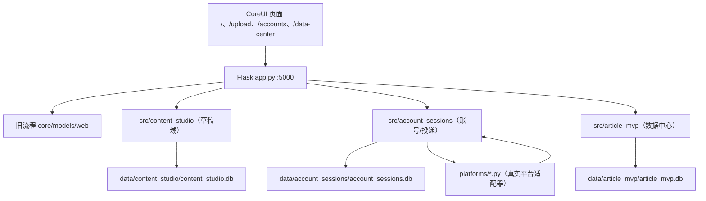

# 交接文档：ArticleOps 多平台内容运营系统（DSH → Codex）

> 生成日期：2026-08-17（Asia/Shanghai）
> 交接类型：DSH 会话结束，移交 Codex 继续开发
> 交付基线：`feat/zhihu-real-delivery @ d3d7cab`（已推送远端）
> 重要原则：只把已提交进交付基线的代码称为"已实现"；计划、历史测试与真实平台闭环严格分开。
> 本文是续篇，前序交接文档为仓库根目录 `codex_handoff.md`（2026-08-13，对应旧基线
> `refactor/publisher-collector-architecture`），接手时应以本文 + 当前 HEAD 为准。

---

## 0. 先看这里：当前真实结论（2026-08-17）

系统已跑通「创作/导入 → 选平台+真实账号 → 保存平台草稿 → 草稿箱验证 → 数据中心展示」主链路，
**公众号除外**（wechat_mp 保留 COMING_SOON）。当前可投递 6 平台：**小黑盒、ZOL、知乎、smzdm、
百家号、小红书**；**微博投递已紧急关闭**（原因见 §9 事故）；抖音/头条账号可用但投递关闭；公开发布
开关保持关闭（默认只存草稿）。

最近真实投递结果（2026-08-17，带 7 图 24 段内容「KVM别当万能按钮…」）：
- 知乎 DRAFT_SAVED ✅
- 其余 6 平台失败，**根因已逐一修复并提交**（详见 §9.2），等待用户重跑带图验收
- 用户已确认：小红书草稿存在但**图片未保存**——已改状态口径（§9.4），图片上传待真实重验

当前测试基线：**268 passed, 2 skipped**（全量 pytest）；前端契约 30 passed, 2 skipped；
ruff 对改动文件干净（仓库存在 68 个历史 E501 长行噪音，分布在各平台适配器的 CSS 选择器常量，
不属于本轮交付，未清理）。

---

## 1. 代码位置与 Git 事实

### 1.1 唯一交付基线仓库

```text
D:\Backup\Documents\article-auto-publisher
```

- SSH 远端：`git@github.com:Ulysses-G-Yang/article-auto-publisher.git`
- 当前分支：`feat/zhihu-real-delivery`（本地/远端一致，无未提交改动）
- 未跟踪文件：仅 `uv.lock`（**用户明确禁止触碰**，不要 add/commit）
- push 需用：`GIT_SSH_COMMAND='ssh -o StrictHostKeyChecking=accept-new'`

### 1.2 死分支清单（远端 16 个 + 本地 1 个 worktree）

**2026-08-17 已处置**：非祖先的两个分支（`hermes/frontend-matrix-ui`、
`agent/source-package-setup`，均含 `工作汇报_731.md`）已打**本地存档分支**
`archive/hermes-frontend-matrix-ui`、`archive/agent-source-package-setup`（内容完整保留），
其余 14 个远端死分支已确认均为 feat 祖先后**直接删除**；hermes worktree
（`D:\Backup\Documents\article-auto-publisher-frontend`）已删除，其中废弃补丁
`content.patch`/`upload.patch` 已复制到 `C:\DSH\archive-hermes-*.patch` 留档。
存档分支为本地引用，不推送远端；如需远端留档可 `git push origin archive/...`。

原始清单（处置前）：

| 分支 | 说明 |
|---|---|
| `refactor/publisher-collector-architecture` | 旧集成基线，feat 的祖先 |
| `refactor/content-studio-backend` | Content Studio 后端集成源 |
| `refactor/coreui-studio-frontend` / `coreui-studio-frontend-impl` | CoreUI 前端集成源 |
| `refactor/frontend-api-decoupling` / `frontend-coreui-dashboard` | 前端/数据中心集成源 |
| `refactor/article-mvp-boundaries` / `backend-xiaoheihe-stage1` | 小黑盒 MVP 边界/阶段源 |
| `feature/account-session-delivery-backend` / `account-session-ui` | 多账号前后端集成源 |
| `feature/platform-matrix-zhihu-v2` | hermes worktree 的上游跟踪 |
| `fix/multiline-editor-validation` | 多行校验修复，55ea422 已是 feat 祖先 |
| `integration/content-studio-review` | 旧集成复核 |
| `agent/account-management-publishing-fixes` / `agent/source-package-setup` | 旧 agent 分支 |
| `hermes/frontend-matrix-ui` | 见下方 ⚠️ |

**⚠️ hermes worktree（重点）**：
- 路径 `D:\Backup\Documents\article-auto-publisher-frontend`（git worktree，非独立克隆）
- 分支 `hermes/frontend-matrix-ui @ 7e4fc2e`，含 **`工作汇报_731.md`**——旧交接文档
  （`codex_handoff.md`）明确"绝不能恢复、暂存或提交"的文件
- 其前端矩阵 UI 已被 feat 分支的知乎化连续编辑器取代，**无继续开发价值**
- worktree 内有 2 个 stash 和 2 个未跟踪 `content.patch`/`upload.patch`（废弃补丁）
- **处置建议**：删除整个 worktree（`git worktree remove`）+ 删除本地/远端该分支。
  删除前如需留档，可先 `git branch -f archive/hermes-frontend-matrix-ui 7e4fc2e` 打本地存档分支。
  此处置需用户确认后执行。

### 1.3 最近提交序列（feat/zhihu-real-delivery，倒序）

```text
d3d7cab fix(delivery): draft-saved + media-incomplete = WITH_WARNINGS, not FAILED
26b8837 fix(media): prefer image file-inputs; slow pacing; correct weibo upload conclusion
be78688 fix(smzdm): draft verification via platform draft box, not just save requests
ba1abeb fix(weibo): prevent draft-save from ever publishing; disable weibo delivery
0fb0af3 fix(frontend): clearer guidance when app drag-in has no File object
60a0685 fix(data-center): translate all statuses to Chinese in task/article/run tables
a1e8299 fix(frontend): business-readable overview and data center
6aa106a fix(frontend): overview shows recent deliveries from new delivery_operations
ed31f17 feat(frontend): paste images directly into rich editor at cursor
9af513f refactor(frontend): drop block concept from editor UI
5aa871d feat(frontend): zhihu-style continuous rich editor for body content
36a642e feat(frontend): drag-drop Word doc import with overlay preview (content UX)
…（更早为前端精简计划 A–E 阶段与后端链路的逐项提交）
```

---

## 2. 架构与目录职责

同一个 Flask 服务（:5000）组合四个边界 + 平台适配层：



### 2.1 平台适配器（`platforms/`）——本轮改动核心

- 每个平台一个文件：`base.py`（`BasePlatform`，publish 流水线编排）+ `zhihu.py`、
  `xiaoheihe.py`、`zol.py`、`weibo.py`、`smzdm.py`、`baijiahao.py`、`xiaohongshu.py`、
  `douyin.py`、`toutiao.py`（后两者无投递）
- `publish()` 编排：`check_login → navigate_to_editor → fill_title → fill_content →
  select_topic → save_draft → publish_now`（save_draft 返回空串即 DRAFT_NOT_VERIFIED）
- `fill_content` 返回 `{text_ok, expected_images, uploaded_images, media_status,
  media_error, failed_images}`；`media_status ∈ not_required/completed/partial/failed`
- 关键通用纪律（本轮确立）：
  - 图片上传控件**优先选 `accept=image`**，不用 `file_inputs.first`（百家号 video 控件教训）
  - 图片循环间隔 `2.5–4.5s`、文字分段留 0.8–1.5s（**风控放慢**，用户明确要求）
  - `ensure_valid_content` 文字校验：插图重排导致顺序不匹配时**降级为警告**不阻断
  - 草稿验证以**平台草稿箱真值**为准（标题出现/计数+1），接口 code 仅作参考
- `src/platforms/content_validation.py`：`ensure_valid_content`（规范化空白后按非空段落有序校验）

### 2.2 src/account_sessions（账号 + 投递执行）

- `platform_catalog.py`：`PLATFORM_CATALOG`（10 平台，weibo 当前 `delivery_enabled=False`）、
  `DELIVERY_ENABLED_PLATFORMS`、`ACCOUNT_ENABLED_PLATFORMS`（契约测试冻结）
- `delivery_service.py`：`DeliveryService`，`execute_operation` 编排平台 publish，
  **本轮新增 `DRAFT_SAVED_WITH_WARNINGS` 状态**（草稿已存+图片未完整 → 不判失败，保留草稿链接，
  error_code=PLATFORM_MEDIA_INCOMPLETE）；`list_recent_operations` 脱敏快照供首页
- `web.py`：`GET /api/delivery-operations`（limit 参数）；`POST /api/delivery-operations` 兼容
- `platform_catalog` weibo 条目：`account_enabled=True, delivery_enabled=False`（投递关闭）
- 账号 Profile 隔离在 `data/account_sessions/profiles/<platform>/<account_id>`；
  legacy xiaoheihe/zol 在 `data/chrome_profiles/`

### 2.3 src/content_studio（草稿域）

- 知乎化连续编辑器由前端实现（见 §4），后端仍是 ContentVersion 不可变版本 + DeliveryPlan 冻结
- `content_reference` 指向 content_studio version_id；投递时由 `content_resolver` 解析
  title/blocks/images 传给平台适配器

### 2.4 src/article_mvp（数据中心）

- `DeliveryBridge.record()` 幂等写 PlatformArticle（PUBLISH → PublishedEventService；
  DRAFT → UNMAPPED + draft_url）
- `synthesize_task_id(operation_id)` 生成 task_id
- 契约：`collector_enabled:false`、`collector_evidence:"legacy_unverified"` —— **未采集前如实展示，
  不伪造指标**（采集链仍挂起，等用户决策）
- 前端 `src/article_mvp/web/templates/dashboard.html` + `static/dashboard.js`：状态中文化、
  平台/标题列、草稿箱链接

---

## 3. 数据库与运行数据（data/ 被 gitignore，勿提交勿清理）

| 数据 | 路径 |
|---|---|
| 旧系统 DB | `data/app.db` |
| 账号会话 DB | `data/account_sessions/account_sessions.db`（含 delivery_operations） |
| Content Studio DB | `data/content_studio/content_studio.db` |
| 数据中心 DB | `data/article_mvp/article_mvp.db`（含 PlatformArticle 7 条 UNMAPPED） |
| 新账号隔离 Profile | `data/account_sessions/profiles/{platform}/{account_id}` |
| 旧 Profile | `data/chrome_profiles/{xiaoheihe,zol}` |
| 日志 | `data/logs/` |

三套新库均为 SQLAlchemy 2.0 Async + aiosqlite（WAL、busy_timeout=5000、foreign_keys=ON）。

投递状态语义（delivery_operations.status）：
`QUEUED / RUNNING / DRAFT_SAVED / DRAFT_SAVED_WITH_WARNINGS / PUBLISHED /
PUBLISHED_WITH_WARNINGS / FAILED / RESULT_UNKNOWN / BLOCKED / CONFIRMATION_REQUIRED`

---

## 4. 前端（web/）

- 模板：`base.html`（侧栏壳）、`index.html`（发布概览 + 最近投递置顶）、`upload.html`（创作与投递）、
  `accounts.html`；`/data-center` 独立模板在 src/article_mvp
- `web/static/js/content-studio.js`：知乎式 rich-editor（contenteditable）——连续所见即所得编辑区、
  光标处插图、剪贴板图片粘贴、Word 拖入导入、600ms 防抖保存、clear-all、平台草稿箱链接
- `web/static/js/app.js`（Alpine 发布概览：/api/delivery-operations + legacy tasks）
- 组件类纪律：只用 btn/badge/card/modal/form-switch
- **注意**：`index.html` 状态映射中已含 `DRAFT_SAVED_WITH_WARNINGS → 草稿已保存（图片未完整）`
  （黄色徽标），修改状态枚举时必须同步此处与 delivery_service

---

## 5. 运行环境与命令

### 5.1 正确 Python（必须用这个）

```text
C:\Users\Administrator\miniconda3\envs\article-publisher-py312\python.exe  (3.12)
```

系统默认 python 是 3.14，不要用。conda env：`article-publisher-py312`。

### 5.2 服务启动/重启（Windows，无守护，易中断）

```powershell
# 重启（每次代码改动后都要重启才生效）
$conn = Get-NetTCPConnection -LocalPort 5000 -State Listen -ErrorAction SilentlyContinue
if ($conn) { Stop-Process -Id $conn[0].OwningProcess -Force; Start-Sleep 2 }
Set-Location D:\Backup\Documents\article-auto-publisher
Start-Process -FilePath "C:\Users\Administrator\miniconda3\envs\article-publisher-py312\python.exe" -ArgumentList "-u","app.py" -WindowStyle Hidden
# 健康检查：Invoke-WebRequest http://127.0.0.1:5000/ → 200
```

### 5.3 测试与检查（每轮必跑）

```powershell
& $python -m pytest -q                      # 全量（当前 268 passed, 2 skipped）
& $python -m pytest -q tests/frontend       # 前端契约（30 passed, 2 skipped）
& $python -m ruff check <改动的文件>          # 改动文件干净即可
node --check web/static/js/<改动的 js>       # 前端语法
```

### 5.4 每轮交付纪律（用户硬性要求）

1. 测试 + ruff + node check 全绿
2. focused commit（只 add 本轮相关文件，**禁止 `git add -A`**，不要碰 `uv.lock`）
3. push 当前分支：`$env:GIT_SSH_COMMAND='ssh -o StrictHostKeyChecking=accept-new'; git push origin feat/zhihu-real-delivery`
4. 真实平台动作（登录/草稿/发布/删除）**必须等用户明确确认**；自动测试绝不触发真实发布

---

## 6. 平台真实账号（9 有效，2026-08-17 状态）

| 平台 | 账号 | 投递 | 备注 |
|---|---|---|---|
| 小黑盒 | 玩家102503316 | ✅ | legacy profile（data/chrome_profiles） |
| ZOL | 1wphk1 | ✅ | legacy profile |
| 知乎 | Ulysses Yang | ✅ | 唯一稳定带图成功平台 |
| 微博 | 大笨蛋你在里面吗（uid 5757098541） | ❌ 关闭 | **曾误发布**，见 §9.1；登录态曾失效 |
| smzdm | 值友3424774480 | ✅ | 自动保存草稿 |
| 百家号 | 他日若得脱身法生吃黄连苦也甜 | ✅ | 封面自动化受限（set_cover 如实失败） |
| 小红书 | jayoma | ✅ | **草稿在但图片未存**，待重验 |
| 抖音 | （账号可用） | ❌ | Web 无草稿箱已定性，投递保持关闭 |
| 头条 | 率真海风gy504gO | ❌ | 账号可用投递关闭 |

---

## 7. 当前未完成项与技术债（按优先级）

1. **P0 小红书图片上传真实验收**：代码已放慢节奏+accept=image 控件优选，但未真实重跑；
   用户指出"可能是风控不是发不了"，需一轮真实带图投递确认（跑前先探测发布页 file input 结构，
   确认正文插图控件，避免传进封面区）
2. **P0 带图投递全平台重验收**：本轮 6 个失败根因已修（§9.2），等用户重跑 7 图 24 段内容，
   逐平台核对草稿箱标题+图片
3. **P0 微博重新开放投递**：需先真实验收 save_draft 防误发布修复（精确按钮匹配+发布接口监听），
   用户确认后才把 `platform_catalog.py` 的 weibo `delivery_enabled` 改回 True，并同步更新
   `tests/test_platform_catalog.py` 契约断言
4. **P1 待用户确认**：清理 hermes worktree 死分支（§1.2 处置建议）
5. **P1 提醒用户清理**：各平台验收/诊断草稿（微博「封面验收测试」、百家号「封面验收测试」、
   头条空草稿等）；微博已真实发布一篇带图文章需用户手动删除（系统无法撤回）
6. **P1 采集链**：collector 仍 `legacy_unverified`，需真实 Network 探测固化为 verified 才能跑
   指标采集；等待用户决策
7. **P2 头条/抖音投递**：头条投递链路未接入；抖音 Web 无草稿箱已定性不可投
8. **P2 公开发布**：开关保持关闭；PUBLISH 需要逐目标一次性确认令牌
9. **P2 前端**：数据中心独立模板未继承 base.html；旧 delivery.html/js/css 保留兼容未下线
10. **P2 历史脏数据**：早期 delivery_operations/PlatformArticle 标题占位符已回填真实标题
    （fix_titles 脚本在 C:\DSH，不入库）；7 条历史 PlatformArticle 为 UNMAPPED 草稿待映射

---

## 8. 本轮事故与根因（重要经验）

### 8.1 微博 save_draft 误触发公开发布（P0，已修复 ba1abeb）

- **事故**：用户反馈"微博没有存草稿，图片带上了，直接给我发出去了"
- **根因**：save_draft 原实现用 `nodes.find(el => el.innerText 去空白后 includes('保存草稿'))`
  **模糊匹配**点击按钮——可能命中发布相关按钮；且草稿箱验证只在 `#/draft`，接口 code=100000
  （geetest 软提示）被误当成功
- **修复**：① 按钮精确匹配（去空白后 `=== '保存草稿'`）；② `_on_response` 监听发布接口
  （url 含 `/publish`、`/article/publish` 或 POST/PUT 含 publish）→ `captured["published"]=True`
  → 立即失败返回 ""；③ 草稿箱验证只认 `#/draft` 列表；④ platform_catalog weibo
  `delivery_enabled=False`（投递关闭）；⑤ 竞态收敛窗口 1–2s
- **教训**：模糊文本匹配点击是发布类动作的高危模式，必须精确匹配 + 发布接口旁路监听

### 8.2 06:56 轮带图投递 6 失败（已逐一修复）

| 平台 | 失败原因 | 修复（提交） |
|---|---|---|
| xiaoheihe | 插图后正文顺序校验失败 CONTENT_VALIDATION_ERROR | 降级为警告（ba1abeb） |
| baijiahao | 编辑器未就绪 SELECTOR_ERROR | 就绪条件合并「存草稿按钮 OR FeEditor」+45s（ba1abeb） |
| zol | `Locator.click Timeout 30000ms`，真凶是 `.editor-draft-tip-box` 悬浮层拦截点击 | `_dismiss_editor_overlays` + `_click_editor` 兜底 focus（26b8837） |
| smzdm | save_draft「自动保存未产生任何保存请求」误报 | 改为强制触发保存 + 草稿箱真值验证（be78688） |
| xiaohongshu | 图片上传失败 media=failed → 整体标 FAILED | 放慢节奏+accept=image+状态口径（26b8837/d3d7cab） |
| weibo | PLATFORM_MEDIA_INCOMPLETE | 投递关闭，等待重验 |

### 8.3 误定性更正（用户纠错）

- ~~"微博自动化插图不可用"~~ → **错误**，用户实测图片能上传；docstring 已更正（26b8837）
- 小红书"连文字草稿都没保存" → **不准确**，日志证实 save_draft 成功、草稿存在（用户已确认
  草稿在，图不在）；失败显示是 delivery_service 把 media=failed 整体标 FAILED 造成的

### 8.4 状态口径修复（d3d7cab）

- 草稿已存 + 图片未完整 → `DRAFT_SAVED_WITH_WARNINGS`（黄徽标、保留草稿链接、可读错误信息），
  不再整体标红失败；草稿未存才 FAILED
- 测试：`tests/test_account_sessions.py` 新增 2 个用例覆盖两种分支

---

## 9. 用户工作流与偏好（必须遵守）

1. **每轮**：测试全绿 → focused commit → push → 报告；不留脏代码
2. **真实操作必须确认**：草稿/发布/删除先问用户；自动测试绝不真实发布
3. **风控高度敏感**：小红书遵守 `docs/XIAOHONGSHU_RISK_CONTROL.md`；节奏放慢是用户明确要求
4. **业务人员视角**：界面状态必须中文可读，拒绝英文状态/占位符（用户多次强烈不满）
5. **先跑通再抠细节**：能先验证主链路的先验证
6. **可以使用子代理**（用户已明确允许）；不要碰 uv.lock；不碰 data/ 运行数据
7. 用户可能把后续任务直接交给 Codex——交接后以本文为准，先做只读预检再动手

---

## 10. 恢复提示（给 Codex）

```text
1. 只读预检：
   git -C D:\Backup\Documents\article-auto-publisher status --short --branch
   （确认在 feat/zhihu-real-delivery，无脏项，仅 uv.lock 未跟踪）
2. 读本文件 + codex_handoff.md + docs/FRONTEND_SIMPLIFICATION_PLAN.md
   + docs/PLATFORM_DRAFTBOX_AUDIT.md + docs/XIAOHONGSHU_RISK_CONTROL.md
3. 确认服务 :5000 可用；不可用按 §5.2 重启
4. 确认三个公开发布开关仍为 false（config.py / 环境变量）
5. 从 §7 优先级开始：先做小红书图片上传的只读探测 → 用户确认后跑带图验收
6. 每轮改动后：pytest 全量 + ruff + node check → focused commit → SSH push
```

---

## 11. 关键文档索引

- 本交接：`codex_handoff_20260817.md`（本文）+ `codex_handoff.md`（旧基线，2026-08-13）
- 前端计划：`docs/FRONTEND_SIMPLIFICATION_PLAN.md`
- 草稿箱盘点：`docs/PLATFORM_DRAFTBOX_AUDIT.md`（各平台草稿箱入口/展示/平台侧问题）
- 小红书风控：`docs/XIAOHONGSHU_RISK_CONTROL.md`
- 开发部署：`docs/DEVELOPMENT_AND_RELEASE_GUIDE.md`
- 测试现状：`docs/TEST_REPORT_CURRENT.md`（历史数据，以当前 pytest 为准）
- 根目录杂项（`MESSAGE_FROM_HERMES.md`、`ARCHITECT_REVIEW.md`、`!!!_ARCHITECT_COMMAND_ACKNOWLEDGE_REQUIRED_!!!.md`
  等）为历史协作文件，无开发价值，可读可忽略，**不要删除**（用户未要求清理）

---

*本文件不含 Cookie、Token、密钥、Profile 内容或原始平台响应。*
