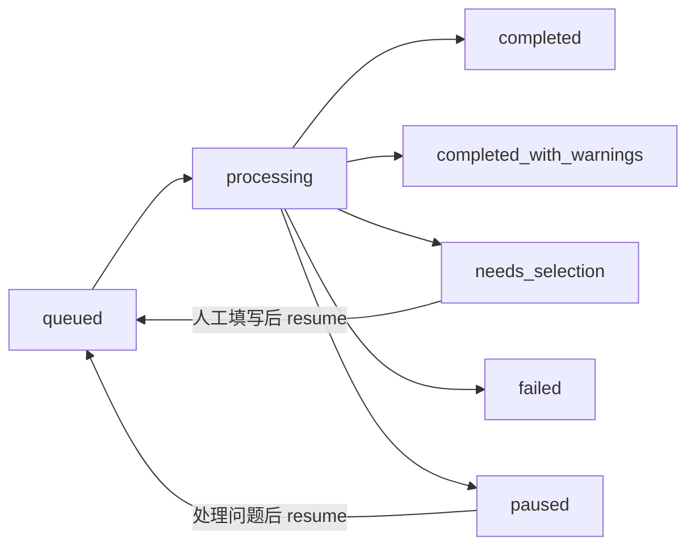

# 自动化文章发布工具：开发、测试与生产上线指导

> 适用范围：当前功能分支 `agent/account-management-publishing-fixes`，只维护 ZOL 和小黑盒。
> 本文是执行和验收手册，不把历史测试报告当作当前版本证据；每次验收都要重新记录代码版本、运行环境和任务 ID。

## 1. 目标与当前边界

第一阶段的成功定义是：在有效登录态下，上传 DOCX，正确写入标题和正文，按平台处理图片和分类/话题，保存草稿，并用草稿箱中的真实标题验证成功。第一阶段不自动公开发布，生产配置必须保持 `PUBLISH_AFTER_DRAFT=false`。

可以由本项目控制的部分：

- 登录态复用和失效识别；
- ZOL 创作者中心编辑器的标题、TinyMCE iframe 正文、图片、话题和草稿验证；
- 小黑盒标题、正文、社区、话题和图片验证；
- 任务状态、错误码、人工选择恢复和 MCP 异步轮询；
- 开发/测试/生产配置隔离、日志脱敏、启动检查和回滚。

不能由本项目保证的平台行为：验证码、短信/人工安全校验、平台临时风控、账号权限变化、Cookie 被服务端吊销和页面突然改版。遇到这些情况必须停在明确状态，不能伪造成功或无限重试。

## 2. 环境划分

| 环境 | 用途 | 绑定地址 | 账号/Profile | 发布策略 |
| --- | --- | --- | --- | --- |
| 开发 | 代码、单元测试、DOM 模拟 | Flask `127.0.0.1:5000`；MCP 默认 `127.0.0.1:8765` | 开发 Profile，禁止复制生产 Cookie | 只保存草稿 |
| 测试 | 真实浏览器和真实平台草稿回归 | Flask 本机；MCP 使用办公内网/VPN 地址 | 独立测试账号和 `data/chrome_profiles/{platform}` | 手动触发，只保存草稿 |
| 生产 | CS_Admin 正式调用 | Flask 仅本机；MCP 仅办公内网/VPN | 全新生产 Profile，与测试完全隔离 | 第一阶段只保存草稿 |

`5000` 是 Flask 业务服务端口，不是给 CS_Admin 连接的接口端口。CS_Admin 连接 MCP 的 `8765/mcp`（或部署时指定的 MCP 端口），MCP 再通过 `FLASK_BASE_URL` 调用本机 Flask。

## 3. 代码责任边界

- `platforms/zol.py`：ZOL 登录、创作者中心编辑器、正文、图片、话题和草稿验证。
- `platforms/xiaoheihe.py`：小黑盒正文、社区、话题和图片流程。
- `platforms/base.py`：平台通用流水线、选择结果和媒体结果归一化。
- `core/queue_manager.py`：队列、平台锁、状态和错误分类；历史任务不自动恢复。
- `web/routes.py`：任务恢复接口、账号接口和网页 API。
- `mcp_server/`：只做 Flask Adapter、文件下载边界和异步任务映射，不重复实现发布逻辑。
- `config.py`：启动时读取配置和环境变量；运行中不热更新。
- `run_flask_production.py`：生产 WSGI 入口；生产不能走 `app.run()`。
- `scripts/check_environment.py`：启动前依赖、Python、目录、端口和生产配置检查。

## 4. ZOL 实现方案

### 4.1 已确认的真实页面结构

真实登录态下的编辑器是：

```text
https://post.zol.com.cn/v2/create/article
```

正文位于 TinyMCE iframe（当前为 `#editor_ifr` / `.tox-edit-area__iframe`）的 `body` 内。图片按钮当前为 `button[title="图片上传"]`，打开 Ant Design 上传弹窗 `.ant-modal-wrap`；本地文件控件在 `.local_upload input[type="file"]`，选择文件后点击 `插入编辑器`。话题入口当前为按钮“选择话题”，弹窗搜索框为 `input[placeholder="搜索话题"]`，候选标题位于 `.list .item .title`。

这些是当前版本的探测结果，不是对平台未来 DOM 的永久承诺。选择器改动时必须先重新做只读 DOM 探测，再修改代码。

### 4.2 图片流程

1. 进入并验证真实编辑器 URL。
2. 统计 TinyMCE iframe 内初始 `img` 数量。
3. 按 DOCX 内容块顺序打开“图片上传”。
4. 使用真实文件控件选择本地图片，点击“插入编辑器”。
5. 等待图片数量增加；每张图独立记录成功/失败。
6. 全部图片验证后再进入保存草稿。
7. 返回 `expected_images`、`uploaded_images`、`failed_images`、`media_status` 和 `media_error_code`。

错误码：

```text
ZOL_IMAGE_FILE_MISSING
ZOL_IMAGE_UPLOAD_CONTROL_NOT_FOUND
ZOL_IMAGE_UPLOAD_FAILED
ZOL_IMAGE_UPLOAD_VERIFY_FAILED
ZOL_IMAGES_PARTIAL
ZOL_IMAGES_ALL_FAILED
```

图片没有真实进入编辑器时，不能标记正常 `completed`。如果文字和草稿已保存但图片失败，任务为 `completed_with_warnings`，并且允许人工恢复；如果同时需要话题选择，任务优先为 `needs_selection`。

### 4.3 话题/分类流程

当前 ZOL 创作者中心实际显示的是“选择话题”，内部统一称为 `selection`，不要把文章整段关键词直接当成候选名称。搜索词来自标题/关键词的有限短词：

1. 先使用人工恢复传入的 `topic`；
2. 否则使用文章关键词生成短查询；
3. 读取实时候选；
4. 只接受精确匹配或唯一包含匹配；
5. 多候选、无候选、控件缺失进入 `needs_selection`；
6. 点击后验证页面真实标签；
7. 保存 `topic_used`、`selection_status` 和选择 JSON。

错误码：

```text
ZOL_SELECTION_CONTROL_NOT_FOUND
ZOL_SELECTION_NO_CANDIDATE
ZOL_SELECTION_AMBIGUOUS
ZOL_SELECTION_VERIFY_FAILED
```

例如“显示器”可能返回多个候选，不能随便取第一项。任务会先保留文字草稿，再在任务详情页或 MCP `resume_task` 中传入真实话题，例如 `显示器分屏`，重新执行并验证。

## 5. 任务状态与错误处理



处理原则：

- `completed`：文字、必要媒体、选择结果和真实草稿验证均通过。
- `completed_with_warnings`：草稿有效，但图片等附加内容有明确警告，不能隐藏。
- `needs_selection`：等待社区/话题/分类人工选择，不能算完成。
- `paused`：浏览器关闭、选择器失效、平台跳转、风控等需要人工处理的不可盲重试错误。
- `failed`：不可恢复或有限重试耗尽。

关键错误分类：

| 错误码 | 处理 |
| --- | --- |
| `LOGIN_REQUIRED` | 标记账号需登录，不重试发布 |
| `BROWSER_CONTEXT_CLOSED` | 当前尝试立即结束，不在已关闭页面继续滚动 |
| `ZOL_BLOG_EDITOR_REDIRECT` | 记录最终 URL，停止无意义重试 |
| `ZOL_SECURITY_CHALLENGE` | 暂停等待人工，不规避验证码/风控 |
| `ZOL_SELECTION_NO_CANDIDATE` / `AMBIGUOUS` | `needs_selection`，人工传入 topic 后恢复 |
| `ZOL_IMAGE_UPLOAD_VERIFY_FAILED` | 警告或暂停，不能伪造图片成功 |
| `DRAFT_NOT_VERIFIED` | 失败/可恢复，必须重新验证草稿箱精确标题 |
| 网络超时 | 仅允许有限重试 |

恢复前必须检查账号登录态和平台锁；同一平台不能同时跑登录和发布两个浏览器流程。

## 6. 开发环境操作

在项目根目录执行：

```powershell
$env:APP_ENV="development"
$env:FLASK_HOST="127.0.0.1"
$env:FLASK_PORT="5000"
$env:MCP_BIND_HOST="127.0.0.1"
$env:MCP_PORT="8765"
$env:MCP_ALLOWED_HOSTS="localhost,127.0.0.1"
$env:MCP_FILE_SERVICE_ALLOWED_HOSTS="dev.sccsai.com"
python -m pip install -r requirements-dev.txt
python scripts/check_environment.py
python -m compileall app.py config.py core platforms web mcp_server
python -m unittest discover -s tests -v
pytest -q
```

开发服务：

```powershell
python app.py
python -m mcp_server.server
```

浏览器入口是 `http://127.0.0.1:5000`；MCP 健康检查是 `http://127.0.0.1:8765/healthz`，协议入口是 `http://127.0.0.1:8765/mcp`。不应在开发环境使用生产密钥或生产 Profile。

## 7. 测试环境回归顺序

每一轮记录：Git commit、Python/Playwright 版本、开始时间、任务 ID、平台、最终状态、错误码和草稿标题；日志不能记录 Cookie 值、密钥或完整绝对敏感路径。

### ZOL 必测

- 有效 Cookie 直接进入创作者中心编辑器；
- 过期/被吊销会进入明确的登录要求；
- 使用含 4 张图片的 DOCX，标题和正文完整；
- 4 张图片编辑器内真实存在；
- 话题真实选中；
- 草稿箱存在精确标题；
- 连续成功 2 次；
- 另做一次无候选 → `needs_selection` → 人工 `resume` → 成功；
- 页面关闭和论坛重定向只出现一次明确错误，不发生同错三次死循环。

### 小黑盒必测

- 连续成功 2 次；
- 社区和话题分开搜索并验证；
- 4 张图片真实上传；
- 无效候选进入 `needs_selection`，不误报成功。

### 系统必测

- 服务重启不自动打开历史任务；
- MCP 重启后仍能轮询已有任务映射；
- `/healthz`、账号状态、任务日志正常；
- 非 `dev.sccsai.com` 文件 Host 被拒绝；
- 同一平台不会并发启动两个浏览器；
- 清理逻辑只移除 Singleton 锁文件，不杀 Chrome、不删除 Cookie。

## 8. 生产预演与上线

生产机器必须是独立 Windows 电脑，并保持用户桌面会话可用；浏览器自动化不能作为没有桌面的 Windows 服务运行。

生产配置至少：

```text
APP_ENV=production
APP_SECRET_KEY=<长度不少于32的随机强密钥>
APP_DEBUG=false
FLASK_HOST=127.0.0.1
FLASK_PORT=5000
MCP_BIND_HOST=<生产内网IP>
MCP_PORT=8765
MCP_ALLOWED_HOSTS=<CS_Admin实际访问Host>
MCP_FILE_SERVICE_ALLOWED_HOSTS=dev.sccsai.com
PUBLISH_AFTER_DRAFT=false
```

生产启动：

```powershell
python scripts/check_environment.py --flask-port 5000 --mcp-port 8765
python run_flask_production.py
python -m mcp_server.server
```

Flask 使用 Waitress；`run_flask_production.py` 会拒绝非生产环境，并启动单独队列 worker。MCP 使用 `python -m mcp_server.server`。Windows 任务计划程序可以用于保持进程，但必须配置为“仅在用户登录时运行”，并让日志可见、可轮转。

正式接入前的预演：安装固定依赖和 Playwright 浏览器、创建全新 Profile、手动登录两个平台、用无敏感内容 DOCX 只保存草稿、从 CS_Admin 通过 MCP 调用、轮询结果、重启服务后再查账号和任务、演练回滚。预演通过后才接生产账号。

## 9. 回滚与运维

上线前备份 SQLite、配置、代码版本和日志归档；不要把 Cookie/Profile、密钥和原始 DOCX 放进 Git。回滚时停止新 Flask/MCP 进程，保留生产数据库和 Profile，切换到上一代码版本，执行兼容迁移后重启并检查 `/healthz`。不得用测试数据库覆盖生产。

日常监控：Flask/MCP 进程、健康检查、队列积压、卡住的 `logging_in`、ZOL 图片失败率、`needs_selection` 数量、草稿验证失败数、磁盘和日志大小。

## 10. 阶段退出标准

只有以下条件全部满足，测试环境才可结束并进入生产预演：

- 指定 Python 环境可执行 `pytest` 和 `unittest`，依赖版本可重现；
- 新增 ZOL 图片、话题、错误码、人工恢复测试通过；
- ZOL 含 4 图 DOCX 连续 2 次完成文字、4 图、话题和草稿闭环；
- ZOL 无候选人工恢复闭环通过；
- 小黑盒连续 2 次完成社区、话题、4 图和草稿闭环；
- MCP Schema、文件白名单、异步持久化和状态映射通过；
- 重启、登录态复用、历史任务不自动启动、平台锁和日志脱敏通过；
- 生产启动检查、Waitress、只保存草稿和回滚演练通过。

在这些条件之前，当前版本仍是测试版本；即使某次手工草稿成功，也不能直接称为生产稳定版。

## 11. 第二阶段范围

第一阶段稳定后，再做正文富文本微调、图片插入位置调整、图片替换/删除、格式保留、发布前预览和公开发布开关。公开发布必须另行审批，并增加管理员确认、平台限速、发布 URL 验证和误发人工处置方案。
