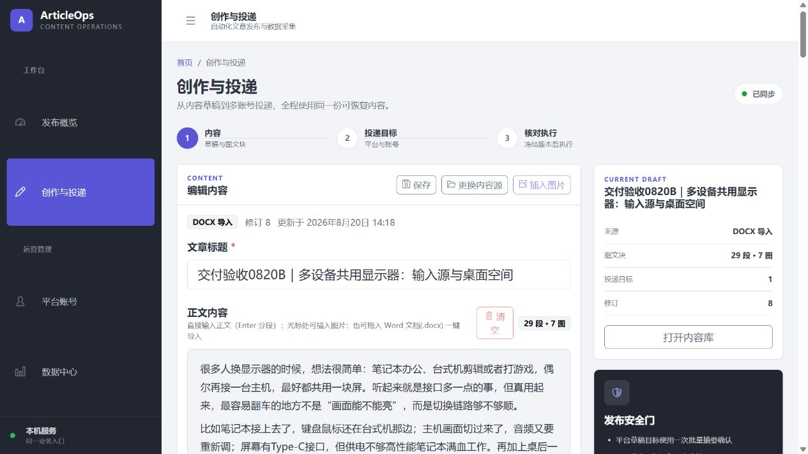
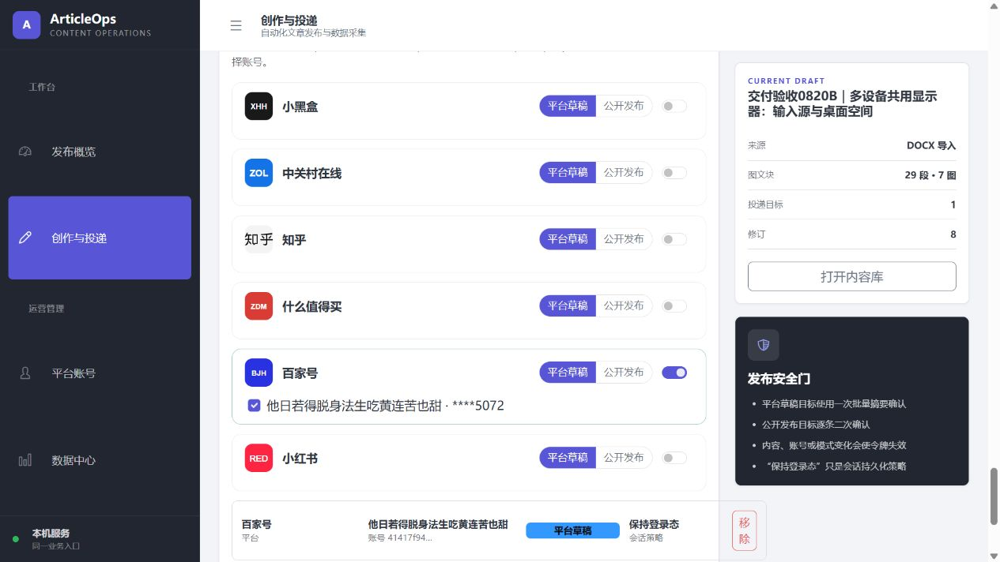
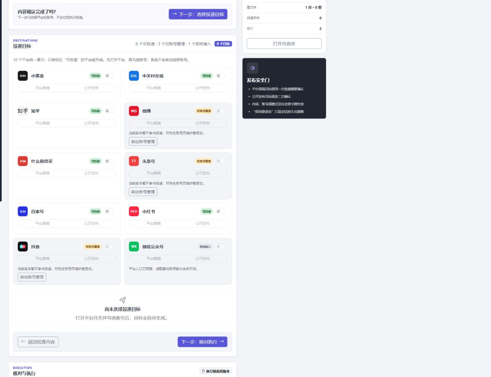
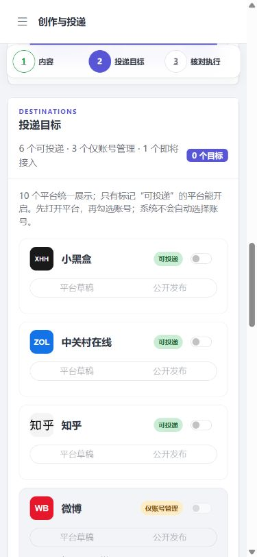

# `/upload` 创作与投递交互审计（2026-08-20）

## 范围与安全边界

- 审计页面：`/upload`。
- 视口：桌面 `1440 × 900`、移动端 `390 × 844`。
- 验收服务使用隔离数据目录和 `5011` 端口；没有登录、上传文件、创建投递计划、保存平台草稿或公开发布。
- 自动化只切换了隔离页面中未选账号的平台开关，用于验证模式按钮的启用关系。

## 审计结论

旧页面功能存在，但交互承诺与真实能力有四处偏差：10 平台目录只展示 6 个可投递平台；未开启平台时模式按钮仍像可操作；长 Word 正文把后续步骤推到很远而步骤条不可导航；前端会在 DOCX 导入后静默把后端的“无封面”默认改成“正文首图”。本轮均已修复。

## 步骤证据

### 1. 内容确认

健康度：修复后良好。

- 保留自动保存、内容库、Word 富文档只读预览和显式封面选择。
- “保存”仅在存在未同步内容或同步错误时可操作，避免和“已同步”状态打架。
- DOCX 导入不再自动选择正文首图，默认保持“无封面”；用户仍可主动选择首图或指定图片。
- 新增“下一步：选择投递目标”，并让顶部步骤条保持可见、可点击。

### 2. 平台与账号

健康度：修复后良好。

- 目录中的 10 个平台全部展示：6 个“可投递”、3 个“仅账号管理”、1 个“即将接入”。
- 只有“可投递”平台能开启；“仅账号管理”提供账号页入口；“即将接入”不会误触发账号或投递请求。
- 平台未开启时，“平台草稿 / 公开发布”模式按钮禁用；开启后才解锁并读取该平台账号。
- 账号请求改为每个平台独立控制，快速开启多个平台不会互相取消请求。
- 桌面采用两列能力矩阵，移动端回到单列；模式按钮独占下一行，避免文字被挤压。

### 3. 核对执行

健康度：修复后良好。

- 目标区新增“返回检查内容 / 下一步：核对执行”，减少同页长距离滚动。
- 缺少标题、正文或目标时，“检查并继续”会自动回到对应步骤并聚焦第一个可处理控件。
- 创建计划期间按钮禁用并显示“正在生成投递计划…”，防止重复点击。
- 原有草稿批量确认、公开发布逐条确认和结果未知禁止自动重试保持不变。

## 可访问性与证据限制

- 步骤导航使用原生锚点，即使脚本异常也保留页面内跳转能力。
- 桌面步骤连线明确设置 `pointer-events: none`，不再覆盖真实点击区域。
- 390 像素视口下 `documentWidth` 和 `bodyWidth` 均不超过可用内容宽度，控制台无应用错误。
- 本轮验证了键盘可聚焦控件、禁用语义、错误聚焦和响应式边界；没有运行完整 axe/WCAG 自动扫描。
